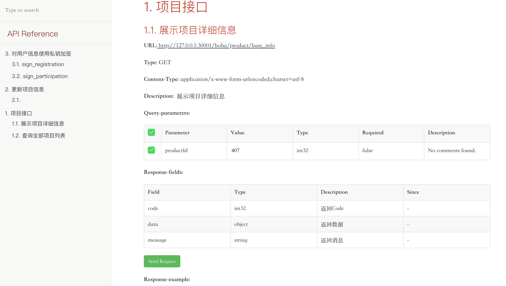

# C2N-BE

## 项目介绍

基于 springboot 的后端接口服务，依赖 mysql 数据库存储数据。

目录结构介绍：

    ./docker_build.env # 构建镜像的配置文件
    ./pom.xml # maven 配置文件
    ./utils # 数据维护更新脚本
    ./common # 公共类
    ./deployment # 部署构建脚本&&文档
    ./portal-api # 后端服务代码
    ./flyway # 数据库版本管理脚本

# 后端服务构建部署说明

## 0. 前置条件

需要确保在开发环境中安装好 jdk8, maven(3.6.3+) && docker(20.10.17+) 和 docker compose(高版本 docker 安装时自带,低版本需要自行安装)

## 1. 数据库

    MySQL 5.7.29

    存储引擎：INNODB
    字符集编码：utf8mb4

| 数据库名 | 用户名 | 密码   |
| -------- | ------ | ------ |
| brewery  | root   | 123456 |

应用列表：

| 服务名          | 开放端口 |
| --------------- | -------- |
| portal-api      | 8080     |
| MySQL（5.7.29） | 3306     |

## 2.本地构建 && 镜像打包：

如果已经安装了 jdk 和 docker，可以执行 sh deploy.sh 自动完成构建和镜像部署

### 2.1 构建 portal-api 服务镜像

    cd c2n-be

    # 打包后端服务
    mvn clean install -Dmaven.test.skip=true

    # 构建容器镜像
    cd portal-api
    ./docker-build.sh

### 2.2 生成接口文档

    cd c2n-be

    mvn -Dfile.encoding=UTF-8 smart-doc:html

    在 portal-api/docs/html 目录下生成 debug-all.html 文件，使用浏览器打开查看接口文档。

    在portal-api/docs/html-example目录下保存了一份示例，供前端调用。

文档示例：



### 2.3 配置修改

#### 2.3.1 新建配置文件

    cd deployment/docker-env

    #复制
    cp portal-api.env.example portal-api.env

#### 2.3.2 修改配置文件 portal-api.env

配置样例如下:

```shell
SPRING_PROFILES_ACTIVE=dev
TZ=Asia/Shanghai

# 私钥
OWNER_PRIVATE_KEY=privatekey

# mysql 数据库配置
DB_HOST=brewery-mysql:3306
DB_NAME=brewery
DB_USERNAME=root
DB_PWD=123456

#链rpc地址
CHAIN_NERWORK_HOST=http://host.docker.internal:8545


```

以上配置中，
OWNER_PRIVATE_KEY 的值需改为私钥内容。
私钥格式：OWNER_PRIVATE_KEY=ac0974bec39a17e36ba4a6b4d238ff944bacb478cbed5efcae784d7bf4f2ff80
DB_XXX 配置为数据库配置，无需修改，如果使用外部数据库可以自行改为对应配置内容。
CHAIN_NERWORK_HOST 为链地址，默认为 hardhat 本地链

### 2.4 启动服务

    docker compose up -d
    或者
    docker-compose up -d  # 使用低版本docker时，单独安装的 docker-compose 时使用

    # 查看服务启动日志
    docker-compose logs -f

（以下在项目流程中可以不用看）

### 2.5 新增项目数据记录（目前后端工程已经自动同步最新项目数据，下面流程仅供同步失败时参考）

#### 2.5.1 使用脚本生成 sql

    cd c2n-be/utils

    首先需要拿到链上 json 数据作为参数（make ido后的结果字符串），使用数据维护脚本更新数据。

    # 用法如下:
    # cd utils
    #  sh generate_update_data.sh [json_file] [server_url]
    # 样例:
    #  sh generate_update_data.sh '{"saleAddress":"0x8aCd85898458400f7Db866d53FCFF6f0D49741FF","saleToken":"0x959922bE3CAee4b8Cd9a407cc3ac1C251C2007B1","saleOwner":"0xf39Fd6e51aad88F6F4ce6aB8827279cffFb92266","tokenPriceInEth":"100000000000","totalTokens":"10000000000000000000000000","saleEndTime":1738934402,"tokensUnlockTime":1738934632,"registrationStart":1738934212,"registrationEnd":1738934332,"saleStartTime":1738934342}' localhost:8080

#### 2.5.3 进入 mysql 容器，连接 mysql 服务，检查数据

    docker exec -it brewery-mysql  /bin/bash
    mysql -uroot -p123456 brewery
