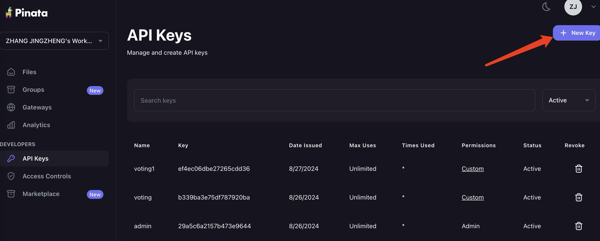
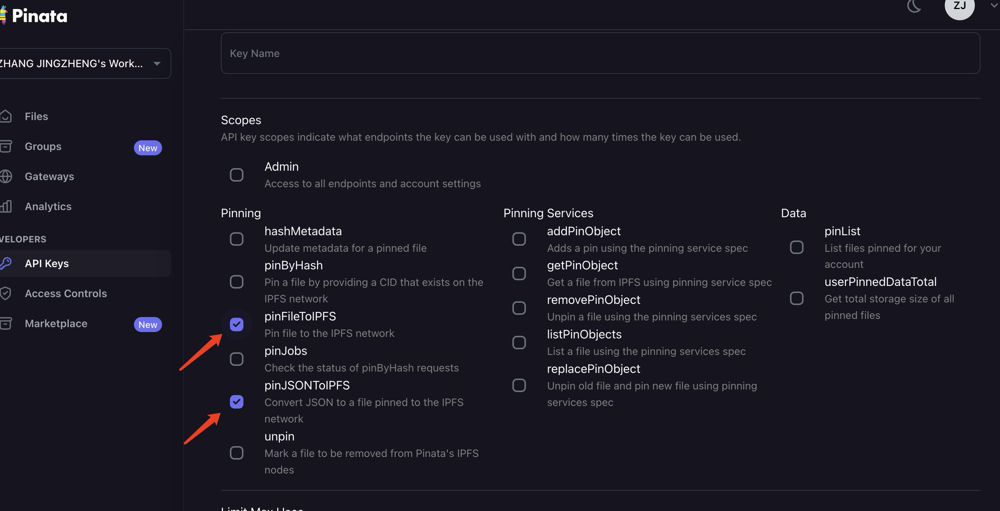
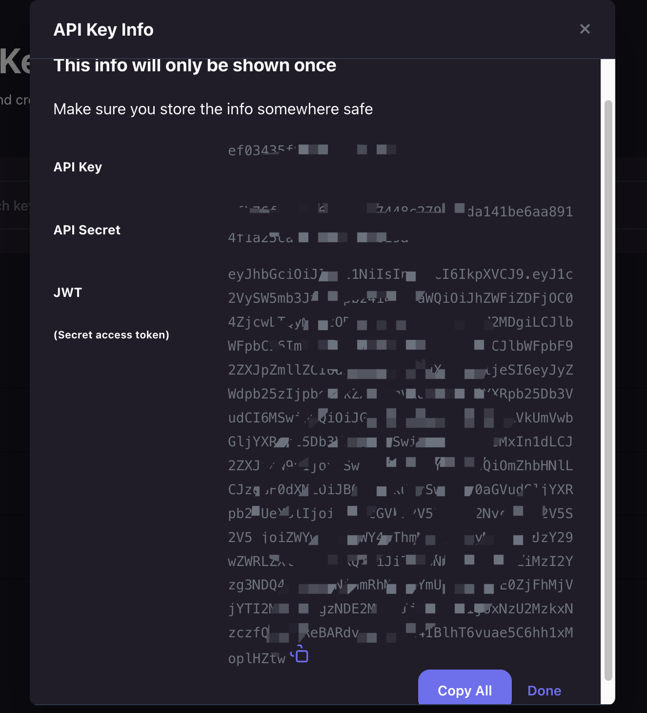
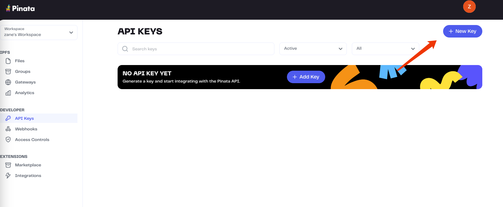
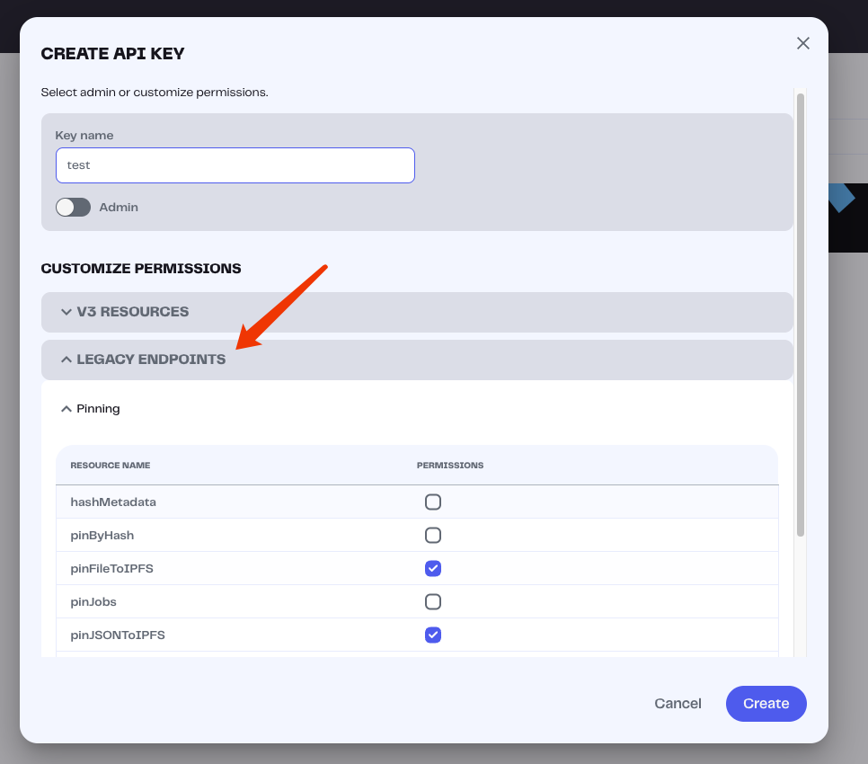
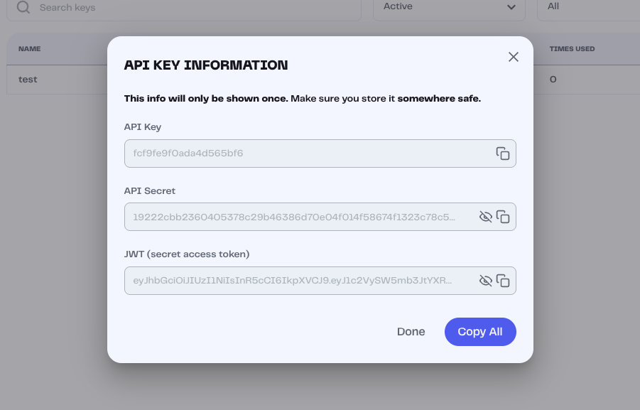

# NFTMarket

## 业务介绍

### 角色

- NFT 买家
- NFT 卖家
- NFT 市场管理员

### 场景

- NFT 买家可以查看 NFT，并购买 NFT
- NFT 卖家可以查看自己的 NFT，并售卖 NFT
- NFT 市场管理员可以修改策展价

## 项目部署

### 本地部署和环境配置

#### 项目环境准备

1.  nodejs,hardhat
2.  [创建 pinata 账号](https://app.pinata.cloud/)
    （创建 pinata 账号使用 ipfs 服务用于上传 NFT 图片）
3.  [创建 apikey](https://app.pinata.cloud/developers/api-keys)
    

    选择下面两个服务，创建 apikey
    

    保存你的 JWT（项目用）、apikey、api_secret
    

    把 apiKey,apiSecret 写到.env 中，形如
    REACT_APP_PINATA_KEY=xxxx
    REACT_APP_PINATA_SECRET=xxxx

    
### Pinata V3 apikeys入口创建变更说明

pinata_v3创建jwt方式如下

#### 项目配置

1. 依赖安装 `npm install`
2. 启动本地链 `npx hardhat node`
3. 部署合约（本地） 【这步骤生产环境中用管理员账号进行部署】

   `npx hardhat run ./scripts/deploy.js --network localhost`

   部署后控制台打印合约地址，初次部署是这个地址：
   0x5FbDB2315678afecb367f032d93F642f64180aa3

4. 启动前端

   `npm start`
